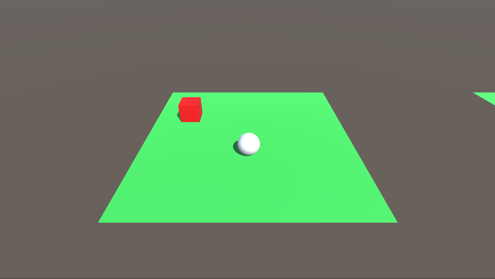

# Unity ML-Agents Study

Unity ML-Agents 공부를 기록하기 위해 만든 repository.  
반드시 공식 문서에 따라 미리 Unity ML-Agetns Toolkit 관련 요소를 미리 설치후 import해야함.

## Development Environment

* Unity Editor: 2021.3.2f1
* [Unity ML-Agents Toolkit: Release 19](https://github.com/Unity-Technologies/ml-agents/tree/release_19)
* Python: 3.6 or higher (I use 3.7.13)
* PyTorch 1.11.0 / CUDA 11.3

> Note: Don't install PyTorch **cpuonly** version. If so, you may not be able to use cuda.

## Structure

* [Custom Trainings](/Custom%20Trainings/) - Custom trainings in which ML-Agents Python low level api is used
* [Unity Project](/Unity%20Project/) - Unity project folder
* [config](/config/) - Training configuration files
* [Training Results](/Training%20Results/) - Training result onnx files

## Unity Environments

직접 만든 Unity Environment들을 간단히 기록함.

### RollerBall

유니티 공식 문서 [Making a New Learning Environment](https://github.com/Unity-Technologies/ml-agents/blob/release_19_docs/docs/Learning-Environment-Create-New.md)에 따라 만든 환경.  
Agent(White Sphere)는 Target(Red Box)에 도달하면 Reward를 획득함.

